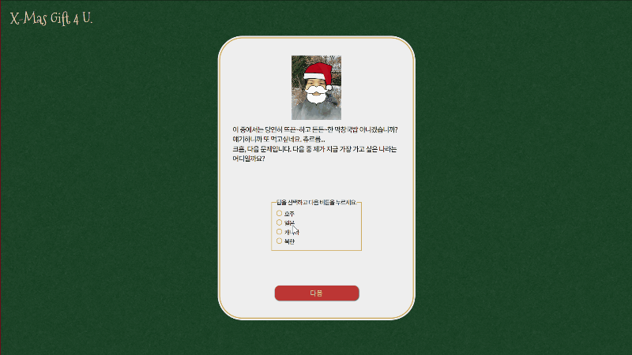
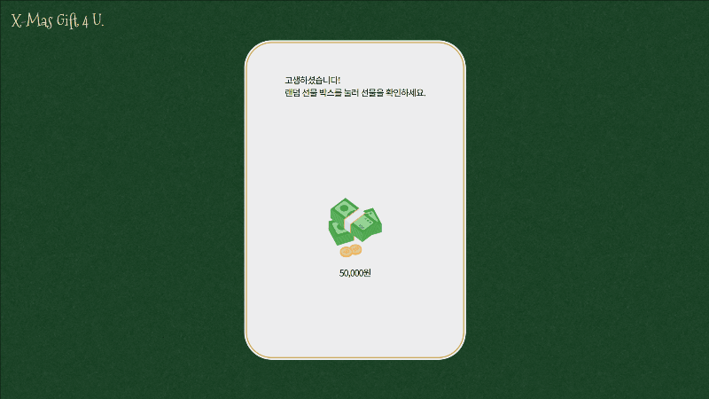

# X Mas Gift 4 U.

2023 크리스마스를 맞이해, 아내를 위해 준비한 선물 랜덤 추첨 서비스입니다.
산타가 내는 문제들을 모두 맞추면, 산타가 랜덤 박스를 선물합니다.
랜덤 박스를 클릭하면 무작위로 선별된 선물이 튀어나와, 안에 있는 선물이 무엇인지 알게 됩니다.

배포 주소는 https://x-mas-gift-4-u-2023.vercel.app/ 입니다.

정답 확인은 https://github.com/qpsqps123/x-mas-gift-4-u-2023/blob/main/src/constants/answerList.js 에서 할 수 있습니다.

## 주요 기능

### 오프닝 & 화면 전환 애니메이션

### 주관식 문제

### 객관식 문제

### 정답인 경우

정답 시 기분 좋은 산타가 표시됩니다.

### 오답인 경우

오답 시 슬픈 산타와 함께 알림이 표시됩니다. 알림에는 디바운싱이 적용되었습니다.

### 선물 랜덤 추첨

선물 박스를 누르면 랜덤 추첨이 진행됩니다.

### 중복 추첨 방지

추첨 선물 결과와 개봉 시간을 Firebase로 보내 중복 추첨을 방지합니다.

### 비정상적인 접근 방지

URL을 통한 비정상적인 접속을 방지합니다.

## 기술 스택

 
  

